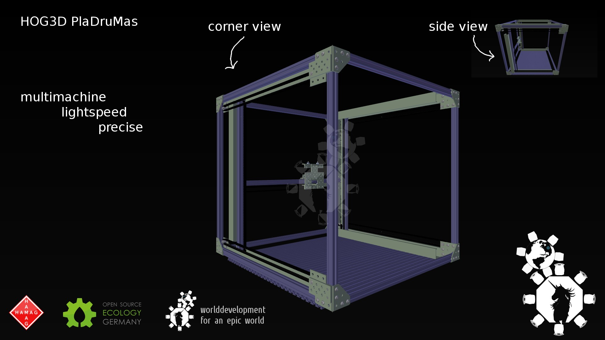
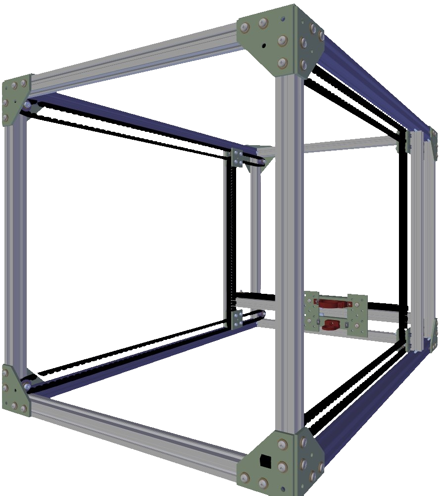

Multimachine lightspeed precise
=======

Alias
---
Previously also known as:
* PUS - Printer universally scalable (subset of multimachine universally scalable)
* HOG3D PlaDruMas (PlatinenDruckMaschine)
The primer term is misleading as this version is not scalable due to an upper limit to the size of T slots available of 0.64 m which is used currently.

It is a, to an as high as possible degree, from <a href="http://wiki.opensourceecology.de/Universal_Prototyping_Kit#Basis-Set_Strukturelemente">Universal Prototyping Kit</a>-Parts  built machine, which shall operate both as 3D printer and circuit mill.

Context
----
###There are 2 different 3D manufacturing machine types in development currently:

* HOG - HOchGeschwindigkeit (leicht, mittleres Volumen, hochgeschwind)
  * 3D PlaDruMas (PUS - Printer Uniprokit Speedy) [UniProKit + Riemen]

* <a href="https://github.com/faerietree/multimachine_universally_scalable">HOF - HOchFestigkeit (massiv, großräumig, langsam)</a>
  * 4D FräDreMas (MUS - Mill Universally Scalable) [made from Schrott + präzisionsgefertigte Massivplatten + Plexiglas]
  * 4D CiPriMa (MUS - Mill Universally Scalable) [made from U + I beams + lead screws, very few and easy to get parts]

It is assumed that a hybrid, that is the perfect machine - as it combines all properties in one - not exists. At least one property combination (massive + ultra high speed (e.g. belts)) seems hard to achieve in one machine.

Requirements/Goals:
---

* High-speed,
* High-precision.
* Modular & Reusable, i.e. assembly + disassembly capable for recycling a no longer used printer into a new machine.

Technical consequences of the goals:
---
High-speed implies
* that belt drive for X- and Y-axis are unavoidable.
High-precision implies
* that airflow must be limited.
* Microstepping. => Reduces danger of oscillation due to control oversteering, with precondition the current can be measured reliably. (Note that without current measurement, half-step is the best that can be achieved.)

Modularity & Recycability implies:
* UniProKit Universal Prototyping Kit parts only.

The High-speed and High-precision requirements imply:
* High computing power and advanced Algorithms are necessary to predict and calculate optimum speed.

Development:
----
* Converted UniProKit parts into Wavefront (.obj) und Solidstereolithic (.stl) konvertiert. (convert script for the free UNIX operating systems <a href="https://github.com/faerietree/multimachine_lightspeed_precise/blob/master/freecad_convert.py">download here</a>).

  *Note: Omit the in tuples occurring '<' and '>' in the following commands! These signalise a placeholder.
  Leading $-character (if exists) followed by space stands for shell/command line and is to be omitted too.*

  * Install FreeCAD:
        sudo apt-get install freecad freecad-dev

    Find FreeCAD.so or FreeCAD.dll:
        cd / && find -name "FreeCAD.*" -type f

    Convert command:
        NUMBER=<choose one of 20|40|60|80|120|160|240|320|400|640> && export FREECAD_LIB_PATH=<path/to/FreeCAD.so or .dll>:$FREECAD_LIB_PATH && python freecad_convert.py basis-set/tslot/TSlot\ $NUMBER.stp basis-set/tslot/TSlot_$NUMBER.obj && python freecad_convert.py basis-set/tslot/TSlot\ $NUMBER.stp kit/T_Slot_$NUMBER.stl

    Follows, how you can rename heaps of files at once in Unixsystems (Linux, Mac OS, Android, FreeBSD, ..).

        rename 's/<search>/<replacement>/' <$PWD or path/to/folder>/<search_pattern>

    *Example: Suche und Ersetzen unter Verwendung von Variablen:*
        NUMBER=80 && rename "s/_$NUMBER[.]/_0$NUMBER./" $PWD/*_$NUMBER.*

First draft of the base structure, using the Z-Axis axis. Volume derived from the excellent <a href="http://mauk.cc/">Cartesio</a>, a bit bigger than the Ultimaker.

This outline divides roughly into 3D-printer and milling and lathes, though a slow machine still can be used for 3D printing, it's just that you have to wait long.
For metal or sintering 3D printers (LASER or e- beam) the structure may again differ a lot. Wind/airflow-protection generally is a favourable thing.

The bigger the moving mass of the axes of the machine, the better the machine must be tied to the ground or the bigger the total mass must be to minimize vibrations that may lead to manufacturing errors.

Furthermore experience shows that a slowly operating machine is less dangerous (while not harmless at all) if something goes wrong. Detecting machine operating errors and stopping it is easier if the machine is moving slowly. This can prevent the death of operator(s).
Splintering milling heads, exploding base structures, by the zentipetal force and mass inertia turn apart lathes, ...
*Yes, this all is a dangerous manoeuvre and one must be confident. Know what you are doing! Pay attention to the machine, don't chat! Be ready to stop the machine at all times. Wear appropriate protection gear.*

###If high mass is important for rigidity why use a lightweight material for axes?

Of course if the motor has huge holding torque, then it might be able to stop even tons of moving mass (impulse) instantly. To reduce the motor size a bit, and thus cost, it's no bad idea to use lightweight material.

As analogon think of you are the motor, an a cannon ball is the moving axis/mass.
If the cannon ball is made from Aluminum, then it's easier and quicker to stop and start abruptly. It also is impossible to mill small circles with highspeed if the moving mass is too big. Try moving the cast iron cannon ball in a tiny and quick circle movement. It won't work - unless you've got very strong motors. Try it!

